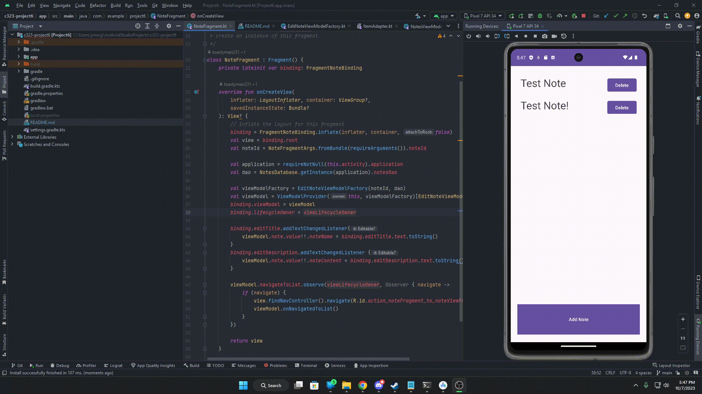

# C323 Project 6 - Notes App

User can create, track, modify, and delete notes that are saved on a local database.

Partners: Grayson Clark, Pascal Koj

## Functionality

The following **required** functionality is completed:

* [x] User can add and delete notes in a main fragment
* [x] Notes are loaded & saved in a local database
* [x] RecyclerView, Adapter, data binding, DiffUtil all used
* [x] Delete button shows confirmation window
* [x] User can edit notes (title and description) by clicking on them

The following **extensions** are implemented:

* ...
* none
* ...

## Video Walkthrough

Here's a walkthrough of implemented features:

Converted with [CloudConvert](https://cloudconvert.com/mp4-to-gif)

## Notes

- Had lots of trouble getting the database to work properly - ended up getting it to work with some modifications.
- collaborated with Grayson Clark
- I collaborated on the project and was unable to add until later and hope this is not an issue, had issues adding to github as well

## License

    Copyright 2023 Pascal Koj

    Licensed under the Apache License, Version 2.0 (the "License");
    you may not use this file except in compliance with the License.
    You may obtain a copy of the License at

        http://www.apache.org/licenses/LICENSE-2.0

    Unless required by applicable law or agreed to in writing, software
    distributed under the License is distributed on an "AS IS" BASIS,
    WITHOUT WARRANTIES OR CONDITIONS OF ANY KIND, either express or implied.
    See the License for the specific language governing permissions and
    limitations under the License.
